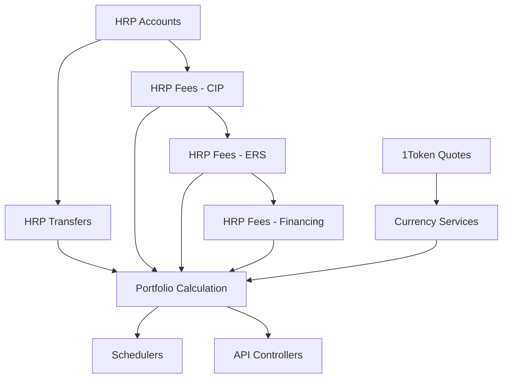

# Phase 4: Business Logic Services Migration - Overview

## Domain-by-Domain, Layer-by-Layer Migration Strategy

### Philosophy
Rather than migrating entire services at once, we'll migrate **domain by domain** and **layer by layer** to enable:
- **Better scope control**: Each task has clear boundaries
- **Parallel development**: Multiple developers can work simultaneously
- **Incremental progress**: Each domain can be tested independently
- **Reduced risk**: Smaller, focused changes

### Migration Approach

#### 1. HRP Data Domains (External Data Layer)
We fetch 3 types of data from HRP:
- **Accounts** (account classification, trading accounts)
- **Fees** (CIP, ERS, Financing fees - migrate one by one)
- **Transfers** (deposits, withdrawals)

#### 2. 1Token Data Domains (External Data Layer)
- **Portfolios** (portfolio data, historical NAV)
- **Quotes** (spot quotes, currency conversion rates)

#### 3. Business Logic Layers (Service Layer)
After external data layer is complete:
- **Processing Services** (data ingestion, transformation)
- **Calculation Services** (fee calculations, currency conversion, portfolio calculations)
- **Aggregation Services** (portfolio aggregation, reporting services)

#### 4. Infrastructure Layers (System Layer)
- **Schedulers** (background jobs, data synchronization)
- **Controllers** (REST API endpoints)

### Task Splitting Strategy

Each domain will have separate documentation files:
1. **HRP Accounts Domain**: `HRP_ACCOUNTS_MIGRATION.md`
2. **HRP Fees Domain**: `HRP_FEES_MIGRATION.md` (CIP, ERS, Financing)
3. **HRP Transfers Domain**: `HRP_TRANSFERS_MIGRATION.md`
4. **1Token Quotes Domain**: `ONETOKEN_QUOTES_MIGRATION.md`
5. **Currency Services**: `CURRENCY_SERVICES_MIGRATION.md`
6. **Portfolio Calculation**: `PORTFOLIO_CALCULATION_MIGRATION.md`
7. **Schedulers**: `SCHEDULERS_MIGRATION.md`
8. **API Controllers**: `API_CONTROLLERS_MIGRATION.md`

### Benefits of This Approach

#### For Project Management
- **Clear dependencies**: Each task document specifies what must be completed first
- **Estimatable scope**: Each domain has well-defined boundaries
- **Parallel execution**: Multiple developers can work on different domains
- **Progress tracking**: Domain-level progress is easily visible

#### For Developers
- **Focused context**: Each developer works on one domain at a time
- **Clear deliverables**: Each task has specific service files to create
- **Independent testing**: Each domain can be unit tested separately
- **Reduced merge conflicts**: Different developers work on different files

### Migration Timeline (Revised)

#### Week 1: HRP Data Domains
- **Developer A**: HRP Accounts Migration (accounts classification, trading accounts)
- **Developer B**: HRP Transfers Migration (transfer processing, ingestion)

#### Week 2: HRP Fees Domain (Sequential)
- **Developer A**: CIP Fees Migration
- **Developer B**: ERS Fees Migration (after CIP is complete)
- **Developer C**: Financing Fees Migration (after ERS is complete)

#### Week 3: 1Token & Currency Domains
- **Developer A**: 1Token Quotes Migration (spot quotes integration)
- **Developer B**: Currency Conversion Services (depends on quotes)

#### Week 4: Portfolio Calculation Domain
- **Developer A**: Portfolio Calculation Service (most complex)
- **Developer B**: Portfolio Fee Aggregation Service

#### Week 5: Infrastructure Layer
- **Developer A**: Schedulers Migration (background jobs)
- **Developer B**: API Controllers Migration (REST endpoints)

#### Week 6: Integration & Testing
- **All Developers**: End-to-end integration testing
- **QA Team**: Calculation accuracy validation

### Success Criteria for Each Domain

#### Data Consistency
- All database operations preserve existing data
- Business rules are exactly preserved
- No data loss during migration

#### Service Compatibility
- Services maintain same input/output interfaces
- Error handling matches original behavior
- Performance equals or exceeds original

#### Code Quality
- Follows NestJS best practices
- Proper dependency injection
- Comprehensive unit tests (≥90% coverage)
- Complete TypeScript typing

### Dependencies Between Domains

### Next Steps

1. **Review this overview** with the team
2. **Assign developers** to specific domains
3. **Begin with HRP Accounts and Transfers** (can run in parallel)
4. **Complete each domain** before moving to dependent domains
5. **Regular check-ins** to ensure consistency across domains

This approach ensures systematic progress while enabling parallel development and maintaining tight scope control.